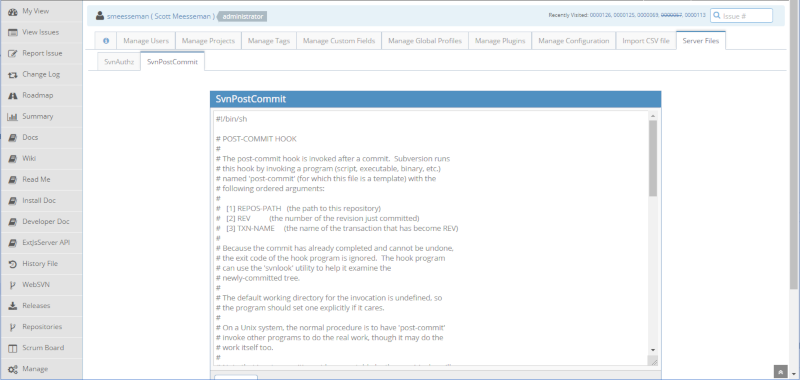

# ServerFiles MantisBT Plugin

- [ServerFiles MantisBT Plugin](#ServerFiles-MantisBT-Plugin)
  - [Description](#Description)
  - [Installation](#Installation)
  - [Issues and Feature Requests](#Issues-and-Feature-Requests)
  - [Screenshots](#Screenshots)
    - [Editor Screen](#Editor-Screen)
  - [Todos](#Todos)

## Description

This plugin allows the user to specify and edit any server file from a new tab in the MantisBT 'Management' section.  An example would be the SVN authz file.

Note the web server must have read access to view the file, and write access to be able to save the file.  Typically in Ubuntu Apache, this user would be `www-data`, for example:

    sudo chown root:www-data /path/to/file
    sudo chmod 770 /path/to/file

## Installation

Extract the release archive to the MantisBT installations plugins folder:

    cd /var/www/mantisbt/plugins
    wget -O ServerFiles.zip https://github.com/mantisbt-plugins/ServerFiles/releases/download/v1.0.0/ServerFiles.zip
    unzip ServerFiles.zip
    rm -f ServerFiles.zip

Ensure to use the latest released version number in the download url:  (version badge available via the [ApiExtend Plugin](https://github.com/mantisbt-plugins/ApiExtend))

Install the plugin using the default installation procedure for a MantisBT plugin in `Manage -> Plugins`.

## Issues and Feature Requests

Issues for my plugins will probably at some point be hosted by my [MantisBT](https://app1.spmeesseman.com/projects/set_project.php?project=ServerFiles&make_default=no&ref=bug_report_page.php) site.  Until that is up and running and configured correctly, please use [GitHub Issues](https://github.com/mantisbt-plugins/ServerFiles/issues) to report any problems or requests.

## Screenshots

### Editor Screen

## Todos

- [ ] Support for marking a file read-only
- [ ] Support for re-ordering display of files
- [ ] Support for granting access to files by Mantis access level
- [ ] Support for granting access to files by user
